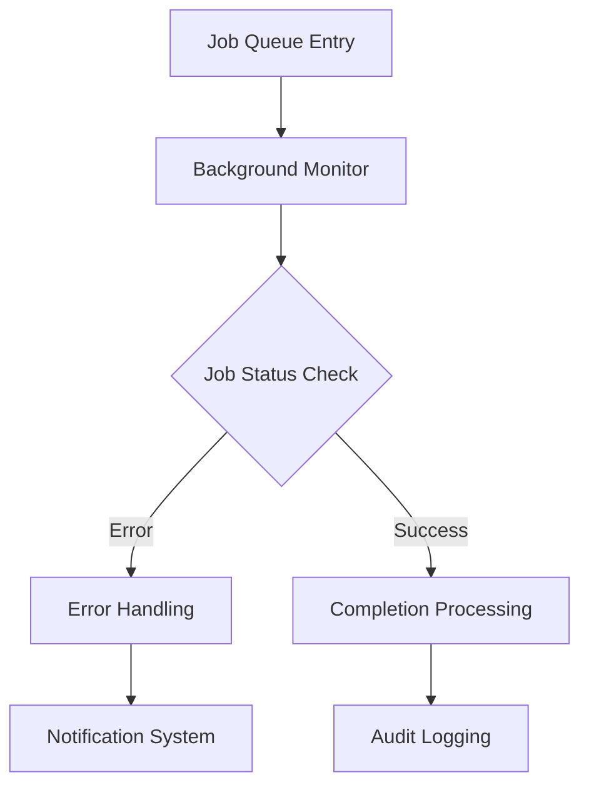
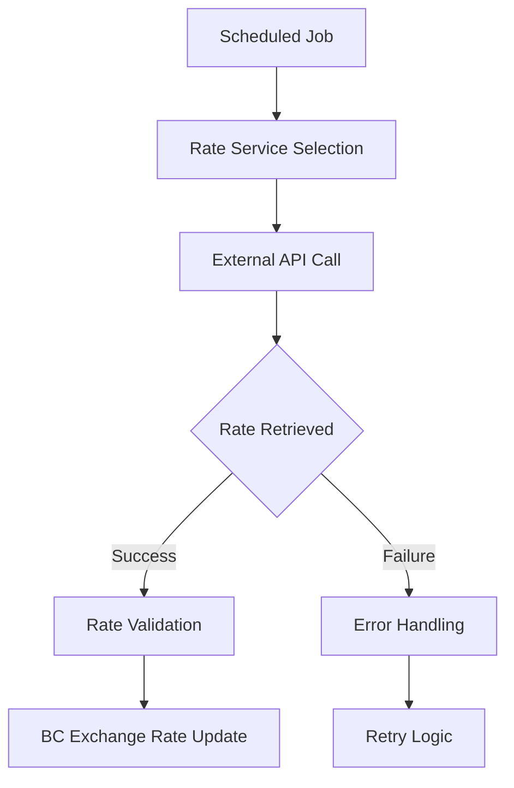

## Integration Overview

BRC Core integrates deeply with Microsoft Dynamics 365 Business Central and connects to various external services to provide enhanced functionality. This section documents all integration points, configuration requirements, and best practices.

## Business Central Platform Integrations

BRC Core enhances core Business Central functionality through seamless platform integrations:

### Job Queue Integration
- **Purpose**: Background monitoring and automated task management
- **Integration Points**: Job Queue Entry table extensions and management
- **Enhanced Features**: User context control, error handling, retry logic

### Currency Management Integration  
- **Purpose**: Automated exchange rate updates
- **Integration Points**: Standard BC currency and exchange rate tables
- **Enhanced Features**: Multiple rate providers, automated scheduling, validation

### User and Permission Integration
- **Purpose**: Feature management and access control
- **Integration Points**: User, User Group, and Permission Set management
- **Enhanced Features**: Conditional access, dynamic feature availability

### Application Insights Integration
- **Purpose**: Telemetry and monitoring
- **Integration Points**: Built-in telemetry framework
- **Configuration**: Pre-configured with BrightCom Solutions instrumentation key

## Documentation Sections



Deep integrations with core Business Central functionality including job queues, user management, and standard business processes.



External service integrations including currency rate providers, monitoring services, and API connections.



## Integration Architecture

### Event-Driven Architecture

BRC Core uses Business Central's event-driven architecture for non-intrusive integrations:

**Event Subscribers**: Listen to standard BC events without modifying core objects
**Integration Events**: Provide extension points for custom implementations  
**Publisher/Subscriber Pattern**: Enables loose coupling with other extensions

### Extension Design Patterns

**Table Extensions**: Enhance standard BC tables with additional fields
**Page Extensions**: Add BRC Core functionality to existing BC pages  
**Codeunit Subscribers**: React to business processes without core modifications

## Data Flow and Processing

### Background Processing Flow

### Currency Rate Update Flow

## Integration Security

### Authentication and Authorization

**Internal Security**:
- Business Central permission sets control access
- Feature management provides granular control
- User context maintained throughout processing

**External Service Security**:
- HTTPS-only connections to external services
- API key management for authenticated services
- Connection timeout and retry mechanisms

### Data Protection

**Data Classification**:
- Appropriate data classification for all BRC Core fields
- GDPR compliance for customer data handling
- Audit trails for sensitive operations

## Performance Considerations

### Integration Performance

**Optimization Strategies**:
- Asynchronous processing for background tasks
- Caching mechanisms for frequently accessed data
- Batch processing for bulk operations

**Resource Management**:
- Connection pooling for external services
- Rate limiting to respect external service limits
- Memory-efficient data processing

### Monitoring Integration Performance

**Performance Metrics**:
- Job queue execution times
- External service response times
- Background monitor processing efficiency
- User feature access response times

## Error Handling and Resilience

### Retry Mechanisms

**Automatic Retry Logic**:
- Configurable retry attempts for failed jobs
- Exponential backoff for external service calls
- Circuit breaker patterns for unreliable services

### Fallback Procedures

**Service Degradation Handling**:
- Graceful degradation when external services fail
- Manual fallback procedures for critical operations
- Alternative service routing for redundancy

## Integration Best Practices

### Development Guidelines

**Extension Development**:
- Use integration events rather than direct modifications
- Follow Business Central development best practices
- Maintain compatibility across BC versions

**Testing Strategies**:
- Test integrations in isolated environments
- Validate external service connectivity
- Performance test under realistic loads

### Deployment Considerations

**Environment Management**:
- Separate configuration for different environments
- Staged rollout procedures for integration changes
- Rollback procedures for failed integrations

**Monitoring and Maintenance**:
- Regular health checks for all integrations
- Proactive monitoring of external service availability
- Scheduled maintenance windows for integration updates

## Troubleshooting Integrations

### Common Integration Issues

**Connectivity Problems**:
- Network connectivity to external services
- Firewall and proxy configuration issues
- Service availability and maintenance windows

**Permission and Authentication Issues**:
- Business Central permission configuration
- External service authentication problems
- User context and security token issues

**Performance Problems**:
- Slow external service responses
- Resource constraints in Business Central
- Concurrent processing bottlenecks

### Diagnostic Tools

**Built-in Diagnostics**:
- Background monitor action entries for error tracking
- Application Insights telemetry for performance analysis
- Admin toolbox utilities for system diagnostics

**External Monitoring**:
- External service status pages
- Network connectivity testing tools
- Performance monitoring dashboards

## Integration Roadmap

### Current Integration Capabilities

**Established Integrations**:
- Full Business Central platform integration
- Multiple currency rate provider connections
- Comprehensive job queue management
- User and permission system integration

### Future Integration Opportunities

**Potential Enhancements**:
- Additional external service providers
- Enhanced telemetry and monitoring capabilities
- Improved automation and orchestration features
- Extended API capabilities for custom integrations

The integration architecture of BRC Core provides a solid foundation for both current functionality and future expansion, ensuring reliable and performant connections across your business technology ecosystem.